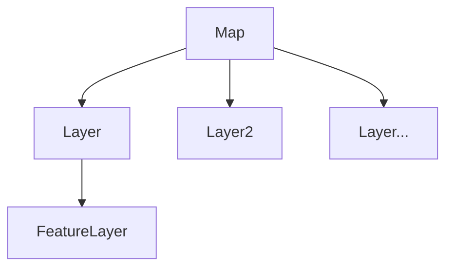
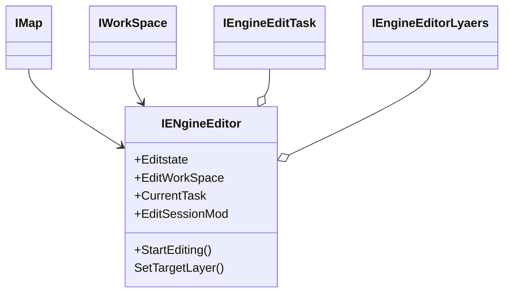
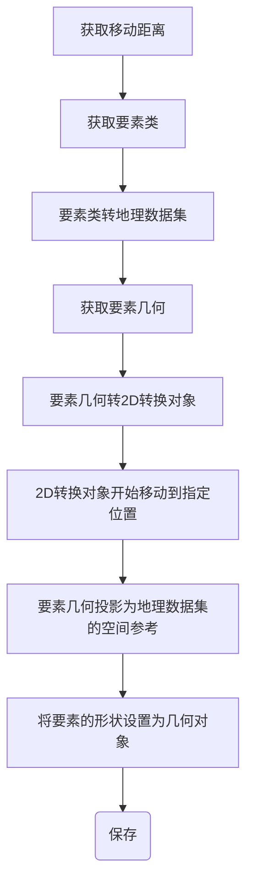

# 1.地图基本操作

## 1.1 加载空间数据

工作空间（WorkSpace）是一个包含数据集、要素类、表等数据的容器，在GeoDatabase类库中，存在三种工作空间类型


数据加载需要打开相对应的工作空间，它是一个普通类，无法直接创建，为获得一个工作空间，需要使用工作空间工厂（WorkSpaceFactory）对象来创建

相关接口和类：

>  ==IWorkSpace==接口定义了工作空间的各种属性和方法.
>
> ==IWorkSpaceFactory== 接口定义创建、打开工作空间的方法和工厂信息成员的访问。
>
> > * Create 方法可创建新的工作空间
> > * Open方法打开已存在的工作空间


***

## 1.2 数据加载

### 1.2.1加载地图文档（mxd）

1. 使用IMapControl接口的LoadMxFile方法加载

==IMapControl== 地图控件，负责地图相关操作的类

> * CheckMxFile方法负责检查mxd是否是有效文档
> * LoadMxdFile方法负责加载

```C#
 if (this.MapControl.CheckMxFile(mxdPath))
                {
                    this.MapControl.LoadMxFile(mxdPath);
                }
```


2. 通过IMapDocument接口加载

==IMapDocument==接口，定义操作和管理地图文档对象的方法和属性，可以使用它获取、更新一个文档内容，同时扮演数据显示和数据视图的双重身份，可以通过ActiveView获得Map数据视图，FocusMap属性获取当前正在使用的Map对象的数据容器身份 ==一个文档对象可能拥有多个Map对象，但只有一个处于可用状态==

```C#
using ESRI.Arcgis.Carto;
string mxdPath = "";
IMapDocument curMapDocument = new MapDocument();
curMapDocument.Open(mxdPath, "");
MapControl.Map = curMapDocument.ActiveView.FocusMap;
MapControl.ActiveView.Refresh();
```

3. 通过ArcGIS Engine中封装好的类库资源COntrolOpenDocCommandClass加载

​         忽略


### 1.2.2 加载shapfile数据

1.通过工作空间加载

涉及类：

==IMap== 接口：地图进行操作的起点，用于管理Map对象中的图层对象，要素选择集合空间参考等，可以获取Map对象中的图层对象，进行添加，删除，实现查询高亮等。

==ILayer== 接口：图层对象的接口，提供操作图层的属性和方法

==IFeatureLayer== 接口：继承ILayer，提供访问矢量数据图层的属性、方法，其数据源可是GeoDatabase，Shapefile，Coverage数据

==IGeoFeatureLayer== 接口：FeatureLayer的组件，提供更多关于要素图层的访问方法，如注记属性、注记显示

==IFeatureClass== ，获取和设置要素类属性的接口

主要关系：




==FeatureLayer :加载在地图中矢量图层，只是要素类的表现形式，FeatureClass是具体的空间实体的集合，拥有Geometry类型==


```C#
IWorkspaceFactory curWorkSpaceF;
IFeatureWorkspace curFeatWorkSpace;
IFeatureLayer curfeatureLayer;
curWorkSpaceF = new ShapefileWorkspaceFactory();
curFeatWorkSpace = (IFeatureWorkspace)curWorkSpaceF.OpenFromFile(@"./data", 0);
IFeatureClass curFeatClass = curFeatWorkSpace.OpenFeatureClass("testData");
curfeatureLayer = new FeatureLayer();
curfeatureLayer.FeatureClass = curFeatClass;
curfeatureLayer.Name = curfeatureLayer.FeatureClass.AliasName;
MapControl.Map.AddLayer(curfeatureLayer);
MapControl.ActiveView.Refresh();
```


2.通过MapControl的AddShapefile方法加载

```C#
this.MapControl.AddShapeFile(@"./data", "testData");
```


## 1.3 加载个人地理数据库

> 省略


## 1.4 加载文本数据

先加载文本数据

```C#
// 点结构 
public struct CPoint
{
    public string name;
    public double x;
    public double y;
}
public List<CPoint> LoadFromCsv()
{
    try
    {
        Dictionary<List<string>, List<CPoint>> pointDic = new Dictionary<List<string>, List<CPoint>>();
        List<CPoint> PointList = new List<CPoint>();
        double[] xLIst = new double[1];
        char[] charArray = new char[] { };
        FileStream fs = new FileStream("./data/test.csv", FileMode.Open);
        StreamReader sr = new StreamReader(fs, Encoding.GetEncoding("GBK"));
        string line = sr.ReadLine();
        if (line != null)
        {
            string[] Fields = line.Split(',');
            while ((line = sr.ReadLine()) != null)
            {
                string[] rowArr = line.Split(',');
                CPoint curPoint = new CPoint();
                curPoint.name = rowArr[1];
                curPoint.x = Convert.ToDouble(rowArr[2]);
                curPoint.y = Convert.ToDouble(rowArr[3]);
                PointList.Add(curPoint);
            }
        }
        else
        {
            return null;
        }

        foreach (var p in PointList)
        {
            Console.WriteLine($"name:{p.name} x:{p.x} y:{p.y}");
        }
        sr.Close();
        return PointList;
    }
    catch (Exception ex)
    {
        DialogResult dr = MessageBox.Show("出错：" + ex.ToString());
        return null;
    }
}
```


创建Shapefile

```C#
private IFeatureLayer GenerateShpFromPoint(List<CPoint> cPoint)
{
    IWorkspaceFactory wsf = new ShapefileWorkspaceFactoryClass();
    IFeatureWorkspace fws = (IFeatureWorkspace)wsf.OpenFromFile("./data", 0);
    IFields pFields = new FieldsClass();
    IField pField = new FieldClass();
    IFieldsEdit pFieldsEdit = (IFieldsEdit)pFields;
    IFieldEdit pFieldEdit = (IFieldEdit)pField;
    pFieldEdit.Name_2 = "Shape";
    pFieldEdit.Type_2 = esriFieldType.esriFieldTypeGeometry;
    IGeometryDef pGeometryDef = new GeometryDefClass();
    IGeometryDefEdit pGeoMetryDefEdit = (IGeometryDefEdit)pGeometryDef;
    pGeoMetryDefEdit.GeometryType_2 = ESRI.ArcGIS.Geometry.esriGeometryType.esriGeometryPoint;
    // 定义坐标系
    ISpatialReferenceFactory pSRF = new SpatialReferenceEnvironmentClass();
    ISpatialReference pSpatialReference = pSRF.CreateGeographicCoordinateSystem((int)esriSRGeoCSType.esriSRGeoCS_WGS1984);
    pGeoMetryDefEdit.SpatialReference_2 = pSpatialReference;
    pFieldEdit.GeometryDef_2 = pGeometryDef;
    pFieldsEdit.AddField(pField);
    IFeatureClass pFeatureClass;
    pFeatureClass = fws.CreateFeatureClass("点测试", pFields, null, null, esriFeatureType.esriFTSimple, "Shape", "");
    IPoint pPoint = new PointClass();
    for (int j = 0; j < cPoint.Count; j++)
    {
        pPoint.X = cPoint[j].x;
        pPoint.Y = cPoint[j].y;
        IFeature pFeature = pFeatureClass.CreateFeature();
        pFeature.Shape = pPoint;
        pFeature.Store();

    }
    IFeatureLayer pFeatureLayer = new FeatureLayerClass();
    pFeatureLayer.Name = "点测试";
    pFeatureLayer.FeatureClass = pFeatureClass;
    return pFeatureLayer;


}
```

最后使用MapControl的Map对象的AddLayer方法添加到地图里。

## 1.5 保存地图文档

使用 ==IMapDocument== 接口，读取已打开的地图文档并替换IMapDocument实例对象的内容。

```C#
// 保持地图文档
string mxdFileName = MapControl.DocumentFilename;
IMapDocument pMapDocument = new MapDocumentClass();
if (mxdFileName != null && MapControl.CheckMxFile(mxdFileName))
{
    MessageBox.Show("地图文档为：" + mxdFileName);
}
else
{
    pMapDocument.New(@"C:\Users\Administrator\Desktop\TempData\Save.mxd");
    pMapDocument.ReplaceContents(MapControl.Map as IMxdContents);
    pMapDocument.Save(pMapDocument.UsesRelativePaths, true);
    pMapDocument.Close();
}

// 另存地图文档
//IMapDocument pMapdocument = new MapDocumentClass();
//pMapdocument.New(@"C:\Users\Administrator\Desktop\TempData\SaveAs.mxd");
//pMapdocument.ReplaceContents(MapControl.Map as IMxdContents);
//pMapdocument.Save(true, true);
//pMapdocument.Close();
```


## 1.6 地图浏览相关

==放大缩小== 

通过改变MapControl当前视图的Extent属性来实现，涉及Envelope。

==包络线==


```C#
// 固定比例放大
//IEnvelope pEnvelope;
//pEnvelope = MapControl.Extent;
//pEnvelope.Expand(ratioX, ratioY, true);// 小数放大，整数缩小
//MapControl.Extent = pEnvelope;
//MapControl.ActiveView.Refresh();

//  固定比例缩小， 以当前视图中心为缩放中心
IActiveView pActiveView = MapControl.ActiveView;
IPoint centerPoint = new PointClass();
centerPoint.PutCoords((pActiveView.Extent.XMin + pActiveView.Extent.XMax) / 2, (pActiveView.Extent.YMin = pActiveView.Extent.YMax) / 2);
IEnvelope pEnvelope = pActiveView.Extent;
pEnvelope.Expand(1.5, 1.5, true);
pActiveView.Extent = pEnvelope;
pActiveView.Refresh();
```


==拉框放大/缩小==

```C#
IEnvelope pEnvelop;
pEnvelop = MapControl.TrackRectangle();
IActiveView pActiiveView = MapControl.ActiveView;
// 拉框放大
//if (pEnvelop == null && pEnvelop.IsEmpty || pEnvelop.Height == 0 || pEnvelop.Width == 0)
//{
//    return;
//}
//else
//{
//    pActiiveView.Extent = pEnvelop;
//    pActiiveView.Refresh();
//}

// 缩小
double dWidth = pActiiveView.Extent.Width * pActiiveView.Extent.Width / pEnvelop.Width;
double dHeight = pActiiveView.Extent.Height * pActiiveView.Extent.Height / pEnvelop.Height;
double dXmin = pActiiveView.Extent.XMin - ((pEnvelop.XMin - pActiiveView.Extent.XMin) * pActiiveView.Extent.Width / pEnvelop.Width);
double dYmin = pActiiveView.Extent.YMin - ((pEnvelop.YMin - pActiiveView.Extent.YMin) * pActiiveView.Extent.Height / pEnvelop.Height);
double dXmax = dXmin + dWidth;
double dYmax = dYmin + dHeight;
pEnvelop.PutCoords(dXmin, dYmin, dXmax, dYmax);
pActiiveView.Extent = pEnvelop;
pActiiveView.Refresh();
```


==全幅显示== 

```C#
mapControl.extent = mapControl.FullExtent;
```


## 1.7 控件量测（通过鼠标）

省略


## 1.8 要素选择

==拉框选择==

==IMap== 接口的SelectByShape方法可以查询到与输入的形状相交的图层中的所有IFeatureLayer接口类型的Feature，值得注意的是：==该FeatureLayer==图层的Selectable属性为true。

```C#

// 矩形框选择要素
IActiveView pactiveView = MapControl.ActiveView;
IEnvelope pEnv = MapControl.TrackRectangle();
IGeometry pGeom = pEnv as IGeometry;
if (pEnv.IsEmpty)
{
    tagRECT r;
    r.left = e.x - 5;
    r.top = e.y - 5;
    r.right = e.x + 5;
    r.bottom = e.y + 5;
    pactiveView.ScreenDisplay.DisplayTransformation.TransformRect(pEnv, ref r, 4);
    pEnv.SpatialReference = pactiveView.FocusMap.SpatialReference;

}
pGeom = pEnv as IGeometry;
MapControl.Map.SelectByShape(pGeom, null, false);
MapControl.Refresh(esriViewDrawPhase.esriViewGeoSelection, null, null);

```


==清除选择==

清空选择的元素

```C#
IActiveView pActiveView = MapControl.ActiveView;
pActiveView.FocusMap.ClearSelection();
pActiveView.PartialRefresh(
    esriViewDrawPhase.esriViewGeoSelection, null, pActiveView.Extent
);
```


## 1.9 地图导出

省略


## 1.10 视图同步


## 1.11 TocControl右键


# 2. 查询统计

## 2.1 属性查询


## 2.2 空间查询


## 2.3 图形查询


***

# 3. 空间编辑

开始编辑

> 1.创建IEngineEditor对象，设置相关属性

==涉及类及接口== 



```C#
curEngineEditor = new EngineEditorClass();
IMap curMap = MapControl.Map as IMap;
IFeatureLayer curlayer = MapControl.get_Layer(0) as IFeatureLayer;
IDataset curDataSet = curlayer.FeatureClass as IDataset;
IWorkspace cws = curDataSet.Workspace;
curEngineEditor.EditSessionMode = esriEngineEditSessionMode.esriEngineEditSessionModeNonVersioned;
curEditTask = curEngineEditor as IEngineEditTask;
curEditTask = curEngineEditor.GetTaskByUniqueName("ControlToolsEditingCreateNewFeatureTask");
curEngineEditor.CurrentTask = curEditTask;
curEngineEditor.EnableUndoRedo(true);
curEngineEditor.StartEditing(cws, curMap);
// 设置编辑图层
curEngineEditLayer = curEngineEditor as IEngineEditLayers;
curEngineEditLayer.SetTargetLayer(curlayer, 0);
```


### 3.1 要素选择

一般过程

> 1. 获取图层要素类（FeatureClass）（包含所有要素）
>
> 2. 获取当前编辑图层及鼠标坐标点ptScreenDisplay.DisplayTransformation.ToMapPoint(x, y)
>
> 3. 计算像素坐标系地理坐标系之间换算关系dlength[ 点击查看](#坐标系转换)
>
> 4. 创建空间过滤对象SpatialFiler，分局图层类型设置过滤条件属性==SpatialRef==属性（不同==图层类型== 选择方式不同，点—包含关系，即落在缓冲区范围内的点被选中；面—相交关系，即选中和缓冲区有重叠的面；线—交叉关系，即选中和缓冲区有交叉的线段）；
>
>    由pt的几何对象创建拓扑对象pTopo
>
> 5. pTopo.Buffer(dlength)生成缓冲区并将几何对象赋给SpatialFilter，将 SpatialFilter --> IQueryFilter对象；执行要素类的Search（IQueryFilter, false）查找，获得一个要素游标
>
> 6. 执行要素游标对象的NextFeature方法获取要素，IMap.SelectFeature(ILayer, feature) 添加到地图


主要代码：

```C#
IFeatureLayer pFeatLayer = MapControl.get_Layer(0) as IFeatureLayer;
IFeatureClass pFeatclass = pFeatLayer.FeatureClass;
IPoint pt = MapControl.ActiveView.ScreenDisplay.DisplayTransformation.ToMapPoint(x, y);
double dLength = MapManager.Pixel2MapUnits(MapControl.ActiveView, 20);
IGeometry geomP = pt as IGeometry;
ISpatialFilter pSpaFil = new SpatialFilter();
ITopologicalOperator pTop = geomP as ITopologicalOperator;
pSpaFil.SpatialRel = esriSpatialRelEnum.esriSpatialRelContains;

IGeometry pBuffer = null;
pBuffer = pTop.Buffer(dLength);
geomP = pBuffer.Envelope as IGeometry;
pSpaFil.Geometry = geomP;
pSpaFil.GeometryField = pFeatclass.ShapeFieldName;
IQueryFilter pQueFil = pSpaFil as IQueryFilter;
IFeatureCursor featCur = pFeatclass.Search(pQueFil, false);
IFeature pFeat = featCur.NextFeature();
if (pFeat != null)
{
    MapControl.Map.SelectFeature(pFeatLayer as ILayer, pFeat);
    MapControl.ActiveView.PartialRefresh(esriViewDrawPhase.esriViewGeoSelection, null, null);
}
else
{
    MessageBox.Show("查询为空");
}
```


<a id=坐标系转换> 计算像素坐标系和地理坐标系之间转换</a>

```C#
// 坐标处理
public static double Pixel2MapUnits(IActiveView activeView, double pixelUnits)
{
    int pixelExtent = activeView.ScreenDisplay.DisplayTransformation.get_DeviceFrame().right -
        activeView.ScreenDisplay.DisplayTransformation.get_DeviceFrame().left;
    double realWorldDisplayExtent = activeView.ScreenDisplay.DisplayTransformation.VisibleBounds.Width;
    double sizeOfPixel = realWorldDisplayExtent / pixelExtent;
    return pixelUnits * sizeOfPixel;
}
```


***


## 3.2 要素移动

移动涉及三个事件：

> 1. <KBD>MouseDown</KBD> 获取待移动的所有元素，创建<u>移动对象</u>，以及移动初始点位置
> 2. <KBD>mouseMove</KBD> 获取鼠标运动过程中的点位置，<u>移动对象</u>移动到该点，在地图上显示移动过程
> 3. <kbd>MouseUp</kbd> 获取终点，计算移动距离后开始移动元素

==获取元素==

> 1.获取目标编辑图层、该图层的选择要素
>
> 2.创建移动反馈对象（MoveGeoFeedback）
>
> 3.遍历选择要素集，将其添加到移动反馈对象

实例代码：

```C#
IFeatureLayer tFeatLayer = cEngineEditLayers.TargetLayer;
fromtPoint = m_activeView.ScreenDisplay.DisplayTransformation.ToMapPoint(x, y);
if (pFeatLyr == null) return;
//获取要移动几何对象
IFeatureCursor pFeatCur = MapManager.GetSelectedFeatures(pFeatLyr);
if (pFeatCur == null)
{
    MessageBox.Show("请选择要移动要素！", "提示",
                    MessageBoxButtons.OK, MessageBoxIcon.Information);
    return;
}
IFeature pFeature = pFeatCur.NextFeature();
//当移动的对象为空时，首先进行对象实例化
if (m_moveGeoFeedBack == null)
    m_moveGeoFeedBack = new MoveGeometryFeedbackClass();
m_moveGeoFeedBack.Display = m_activeView.ScreenDisplay;
while (pFeature != null)
{
    m_moveGeoFeedBack.AddGeometry(pFeature.Shape);
    pFeature = pFeatCur.NextFeature();
}
//添加起始点
m_moveGeoFeedBack.Start(fromtPoint);
```


其中的==GetSelectedFeatures== 方法

> 1.获取目标要素图层
>
> 2.将要素图层 --> 要素选择对象
>
> 3.获取要素选择对象的选择集（SelectionSet）属性
>
> 4.通过选择集的Search方法获取要素游标（FeatureCursor）对象

```C#
public static IFeatureCursor GetSelectedFeatures(IFeatureLayer featureLayer)
{
    ICursor pCursor = null;
    IFeatureCursor pFeatCur = null;
    if (featureLayer == null) return null;
    IFeatureSelection featSelection = featureLayer as IFeatureSelection;
    ISelectionSet pSelSet = featSelection.SelectionSet;
    if (pSelSet.Count == 0) return null;
    pSelSet.Search(null, false, out pCursor);
    pFeatCur = pCursor as IFeatureCursor;
    return pFeatCur;
}
```


***

 ==计算距离== 

> 输入起点、终点坐标后输出横向坐标移动距离

```C#
public static bool CalDistance(IPoint lastpoint, IPoint firstpoint, out double deltaX, out double deltaY)
{
    deltaX = 0; deltaY = 0;
    if (lastpoint == null || firstpoint == null)
        return false;
    deltaX = lastpoint.X - firstpoint.X;
    deltaY = lastpoint.Y - firstpoint.Y;
    return true;
}
```


***

==移动元素==

> 1.开启EngineEditor 编辑流
>
> 2.获移动的图层，待移动的选择元素游标
>
> 3.遍历游标，移动元素停止编辑流

```C#
private void MoveFeatures(IPoint lastpoint, IPoint firstpoint)
{
    m_EngineEditor.StartOperation();
    IFeatureLayer pFeatLyr = m_EngineEditLayers.TargetLayer;
    IFeatureCursor pFeatCur = MapManager.GetSelectedFeatures(pFeatLyr);
    IFeature pFeature = pFeatCur.NextFeature();
    while (pFeature != null)
    {
        MoveFeature(pFeature, lastpoint, firstpoint);
        pFeature = pFeatCur.NextFeature();
    }
    m_EngineEditor.StopOperation("MoveTool"); System.Runtime.InteropServices.Marshal.ReleaseComObject(pFeatCur); m_activeView.PartialRefresh(esriViewDrawPhase.esriViewGeoSelection | esriViewDrawPhase.esriViewGeography, null, null);
}
```


==移动操作（MoveFeature）==




```C#
private void MoveFeature(IFeature pFeature, IPoint lastpoint,IPoint firstpoint)
{
    double deltax; double deltay;
    IGeoDataset pGeoDataSet;
    ITransform2D transform;
    IGeometry pGeometry;
    IFeatureClass pClass = pFeature.Class as IFeatureClass;
    pGeoDataSet = pClass as IGeoDataset;

    pGeometry = pFeature.Shape;
    if (pGeometry.GeometryType == esriGeometryType.esriGeometryMultiPatch
        || pGeometry.GeometryType == esriGeometryType.esriGeometryPoint
        || pGeometry.GeometryType == esriGeometryType.esriGeometryPolyline
        || pGeometry.GeometryType == esriGeometryType.esriGeometryPolygon)
    {
        pGeometry = pFeature.Shape;
        transform = pGeometry as ITransform2D;
        if (!MapManager.CalDistance(lastpoint, firstpoint, out deltax, out deltay))
        {
            MessageBox.Show("计算距离出现错误", "提示",
                            MessageBoxButtons.OK, MessageBoxIcon.Information);
            return;
        }
        transform.Move(deltax, deltay);
        pGeometry = (IGeometry)transform;
        if (pGeoDataSet.SpatialReference != null)
        {
            pGeometry.Project(pGeoDataSet.SpatialReference);
        }
        pFeature.Shape = pGeometry;
        // 若要素存在Z值或M值，移动之后需要修改为对应数值
        //pFeature.Shape = MapManager.ModifyGeomtryZMValue(pClass, pGeometry);
        pFeature.Store();
    }
}
```


其中==ModifyGeomtryZMValue== 方法：

```C#
public static IGeometry ModifyGeomtryZMValue(IObjectClass featureClass, IGeometry modifiedGeo)
{
    IFeatureClass trgFtCls = featureClass as IFeatureClass;
    if (trgFtCls == null) return null;
    string shapeFieldName = trgFtCls.ShapeFieldName;
    IFields fields = trgFtCls.Fields;
    int geometryIndex = fields.FindField(shapeFieldName);
    IField field = fields.get_Field(geometryIndex);
    IGeometryDef pGeometryDef = field.GeometryDef;
    IPointCollection pPointCollection = modifiedGeo as IPointCollection;
    if (pGeometryDef.HasZ)  //属性中有Z值
    {
        IZAware pZAware = modifiedGeo as IZAware;
        pZAware.ZAware = true;//可以使用Z值
        IZ iz1 = modifiedGeo as IZ;
        iz1.SetConstantZ(0);//将Z值设置为0
    }
    else
    {
        IZAware pZAware = modifiedGeo as IZAware;
        pZAware.ZAware = false;
    }
    if (pGeometryDef.HasM)//属性中有M值
    {
        IMAware pMAware = modifiedGeo as IMAware;
        pMAware.MAware = true;//可以使用M值
    }
    else
    {
        IMAware pMAware = modifiedGeo as IMAware;
        pMAware.MAware = false;
    }
    return modifiedGeo;
}
```


***


## 3.3 添加元素

步骤：

> 1.判断当前图层几何类型为点/线/面
>
> 2.针对不同几何类型创建<u>新几何反馈对象</u> 
>
> 3.针对不同的要素类型，创建流程不同：
>
> > 点：<kbd>鼠标点击</kbd> 直接创建新点元素
> >
> > 线：<kbd>鼠标点击</kbd> 捕捉移动事件，获取后续点，双击完成新线元素绘制，双击时创建
> >
> > 面：同线
> >
> > 多点：同线


