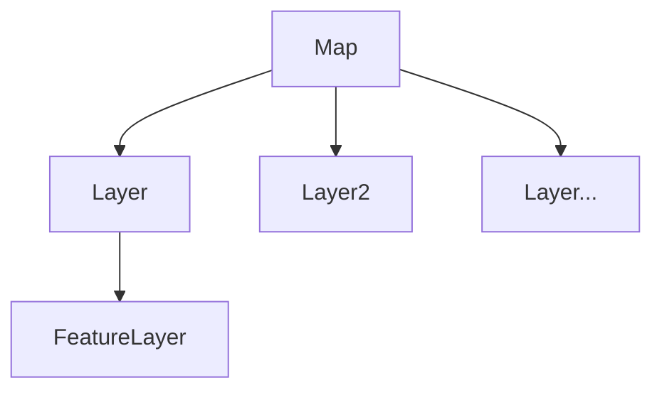

# 1.地图基本操作

## 1.1 加载空间数据

工作空间（WorkSpace）是一个包含数据集、要素类、表等数据的容器，在GeoDatabase类库中，存在三种工作空间类型


数据加载需要打开相对应的工作空间，它是一个普通类，无法直接创建，为获得一个工作空间，需要使用工作空间工厂（WorkSpaceFactory）对象来创建

相关接口和类：

>  ==IWorkSpace==接口定义了工作空间的各种属性和方法.
>
> ==IWorkSpaceFactory== 接口定义创建、打开工作空间的方法和工厂信息成员的访问。
>
> > * Create 方法可创建新的工作空间
> > * Open方法打开已存在的工作空间


***

## 1.2 数据加载

### 1.2.1加载地图文档（mxd）

1. 使用IMapControl接口的LoadMxFile方法加载

==IMapControl== 地图控件，负责地图相关操作的类

> * CheckMxFile方法负责检查mxd是否是有效文档
> * LoadMxdFile方法负责加载

```C#
 if (this.MapControl.CheckMxFile(mxdPath))
                {
                    this.MapControl.LoadMxFile(mxdPath);
                }
```


2. 通过IMapDocument接口加载

==IMapDocument==接口，定义操作和管理地图文档对象的方法和属性，可以使用它获取、更新一个文档内容，同时扮演数据显示和数据视图的双重身份，可以通过ActiveView获得Map数据视图，FocusMap属性获取当前正在使用的Map对象的数据容器身份 ==一个文档对象可能拥有多个Map对象，但只有一个处于可用状态==

```C#
using ESRI.Arcgis.Carto;
string mxdPath = "";
IMapDocument curMapDocument = new MapDocument();
curMapDocument.Open(mxdPath, "");
MapControl.Map = curMapDocument.ActiveView.FocusMap;
MapControl.ActiveView.Refresh();
```

3. 通过ArcGIS Engine中封装好的类库资源COntrolOpenDocCommandClass加载

​         忽略


### 1.2.2 加载shapfile数据

1.通过工作空间加载

涉及类：

==IMap== 接口：地图进行操作的起点，用于管理Map对象中的图层对象，要素选择集合空间参考等，可以获取Map对象中的图层对象，进行添加，删除，实现查询高亮等。

==ILayer== 接口：图层对象的接口，提供操作图层的属性和方法

==IFeatureLayer== 接口：继承ILayer，提供访问矢量数据图层的属性、方法，其数据源可是GeoDatabase，Shapefile，Coverage数据

==IGeoFeatureLayer== 接口：FeatureLayer的组件，提供更多关于要素图层的访问方法，如注记属性、注记显示

==IFeatureClass== ，获取和设置要素类属性的接口

主要关系：




==FeatureLayer :加载在地图中矢量图层，只是要素类的表现形式，FeatureClass是具体的空间实体的集合，拥有Geometry类型==


```C#
IWorkspaceFactory curWorkSpaceF;
IFeatureWorkspace curFeatWorkSpace;
IFeatureLayer curfeatureLayer;
curWorkSpaceF = new ShapefileWorkspaceFactory();
curFeatWorkSpace = (IFeatureWorkspace)curWorkSpaceF.OpenFromFile(@"./data", 0);
IFeatureClass curFeatClass = curFeatWorkSpace.OpenFeatureClass("testData");
curfeatureLayer = new FeatureLayer();
curfeatureLayer.FeatureClass = curFeatClass;
curfeatureLayer.Name = curfeatureLayer.FeatureClass.AliasName;
MapControl.Map.AddLayer(curfeatureLayer);
MapControl.ActiveView.Refresh();
```


2.通过MapControl的AddShapefile方法加载

```C#
this.MapControl.AddShapeFile(@"./data", "testData");
```


## 1.3 加载个人地理数据库

> 省略


## 1.4 加载文本数据

先加载文本数据

```C#
// 点结构 
public struct CPoint
{
    public string name;
    public double x;
    public double y;
}
public List<CPoint> LoadFromCsv()
{
    try
    {
        Dictionary<List<string>, List<CPoint>> pointDic = new Dictionary<List<string>, List<CPoint>>();
        List<CPoint> PointList = new List<CPoint>();
        double[] xLIst = new double[1];
        char[] charArray = new char[] { };
        FileStream fs = new FileStream("./data/test.csv", FileMode.Open);
        StreamReader sr = new StreamReader(fs, Encoding.GetEncoding("GBK"));
        string line = sr.ReadLine();
        if (line != null)
        {
            string[] Fields = line.Split(',');
            while ((line = sr.ReadLine()) != null)
            {
                string[] rowArr = line.Split(',');
                CPoint curPoint = new CPoint();
                curPoint.name = rowArr[1];
                curPoint.x = Convert.ToDouble(rowArr[2]);
                curPoint.y = Convert.ToDouble(rowArr[3]);
                PointList.Add(curPoint);
            }
        }
        else
        {
            return null;
        }

        foreach (var p in PointList)
        {
            Console.WriteLine($"name:{p.name} x:{p.x} y:{p.y}");
        }
        sr.Close();
        return PointList;
    }
    catch (Exception ex)
    {
        DialogResult dr = MessageBox.Show("出错：" + ex.ToString());
        return null;
    }
}
```


创建Shapefile

```C#
private IFeatureLayer GenerateShpFromPoint(List<CPoint> cPoint)
{
    IWorkspaceFactory wsf = new ShapefileWorkspaceFactoryClass();
    IFeatureWorkspace fws = (IFeatureWorkspace)wsf.OpenFromFile("./data", 0);
    IFields pFields = new FieldsClass();
    IField pField = new FieldClass();
    IFieldsEdit pFieldsEdit = (IFieldsEdit)pFields;
    IFieldEdit pFieldEdit = (IFieldEdit)pField;
    pFieldEdit.Name_2 = "Shape";
    pFieldEdit.Type_2 = esriFieldType.esriFieldTypeGeometry;
    IGeometryDef pGeometryDef = new GeometryDefClass();
    IGeometryDefEdit pGeoMetryDefEdit = (IGeometryDefEdit)pGeometryDef;
    pGeoMetryDefEdit.GeometryType_2 = ESRI.ArcGIS.Geometry.esriGeometryType.esriGeometryPoint;
    // 定义坐标系
    ISpatialReferenceFactory pSRF = new SpatialReferenceEnvironmentClass();
    ISpatialReference pSpatialReference = pSRF.CreateGeographicCoordinateSystem((int)esriSRGeoCSType.esriSRGeoCS_WGS1984);
    pGeoMetryDefEdit.SpatialReference_2 = pSpatialReference;
    pFieldEdit.GeometryDef_2 = pGeometryDef;
    pFieldsEdit.AddField(pField);
    IFeatureClass pFeatureClass;
    pFeatureClass = fws.CreateFeatureClass("点测试", pFields, null, null, esriFeatureType.esriFTSimple, "Shape", "");
    IPoint pPoint = new PointClass();
    for (int j = 0; j < cPoint.Count; j++)
    {
        pPoint.X = cPoint[j].x;
        pPoint.Y = cPoint[j].y;
        IFeature pFeature = pFeatureClass.CreateFeature();
        pFeature.Shape = pPoint;
        pFeature.Store();

    }
    IFeatureLayer pFeatureLayer = new FeatureLayerClass();
    pFeatureLayer.Name = "点测试";
    pFeatureLayer.FeatureClass = pFeatureClass;
    return pFeatureLayer;


}
```

最后使用MapControl的Map对象的AddLayer方法添加到地图里。

## 1.5 保存地图文档

使用 ==IMapDocument== 接口，读取已打开的地图文档并替换IMapDocument实例对象的内容。

```C#
// 保持地图文档
string mxdFileName = MapControl.DocumentFilename;
IMapDocument pMapDocument = new MapDocumentClass();
if (mxdFileName != null && MapControl.CheckMxFile(mxdFileName))
{
    MessageBox.Show("地图文档为：" + mxdFileName);
}
else
{
    pMapDocument.New(@"C:\Users\Administrator\Desktop\TempData\Save.mxd");
    pMapDocument.ReplaceContents(MapControl.Map as IMxdContents);
    pMapDocument.Save(pMapDocument.UsesRelativePaths, true);
    pMapDocument.Close();
}

// 另存地图文档
//IMapDocument pMapdocument = new MapDocumentClass();
//pMapdocument.New(@"C:\Users\Administrator\Desktop\TempData\SaveAs.mxd");
//pMapdocument.ReplaceContents(MapControl.Map as IMxdContents);
//pMapdocument.Save(true, true);
//pMapdocument.Close();
```


## 1.6 地图浏览相关

==放大缩小== 

通过改变MapControl当前视图的Extent属性来实现，涉及Envelope。

==包络线==


```C#
// 固定比例放大
//IEnvelope pEnvelope;
//pEnvelope = MapControl.Extent;
//pEnvelope.Expand(ratioX, ratioY, true);// 小数放大，整数缩小
//MapControl.Extent = pEnvelope;
//MapControl.ActiveView.Refresh();

//  固定比例缩小， 以当前视图中心为缩放中心
IActiveView pActiveView = MapControl.ActiveView;
IPoint centerPoint = new PointClass();
centerPoint.PutCoords((pActiveView.Extent.XMin + pActiveView.Extent.XMax) / 2, (pActiveView.Extent.YMin = pActiveView.Extent.YMax) / 2);
IEnvelope pEnvelope = pActiveView.Extent;
pEnvelope.Expand(1.5, 1.5, true);
pActiveView.Extent = pEnvelope;
pActiveView.Refresh();
```


==拉框放大/缩小==

```C#
IEnvelope pEnvelop;
pEnvelop = MapControl.TrackRectangle();
IActiveView pActiiveView = MapControl.ActiveView;
// 拉框放大
//if (pEnvelop == null && pEnvelop.IsEmpty || pEnvelop.Height == 0 || pEnvelop.Width == 0)
//{
//    return;
//}
//else
//{
//    pActiiveView.Extent = pEnvelop;
//    pActiiveView.Refresh();
//}

// 缩小
double dWidth = pActiiveView.Extent.Width * pActiiveView.Extent.Width / pEnvelop.Width;
double dHeight = pActiiveView.Extent.Height * pActiiveView.Extent.Height / pEnvelop.Height;
double dXmin = pActiiveView.Extent.XMin - ((pEnvelop.XMin - pActiiveView.Extent.XMin) * pActiiveView.Extent.Width / pEnvelop.Width);
double dYmin = pActiiveView.Extent.YMin - ((pEnvelop.YMin - pActiiveView.Extent.YMin) * pActiiveView.Extent.Height / pEnvelop.Height);
double dXmax = dXmin + dWidth;
double dYmax = dYmin + dHeight;
pEnvelop.PutCoords(dXmin, dYmin, dXmax, dYmax);
pActiiveView.Extent = pEnvelop;
pActiiveView.Refresh();
```


==全幅显示== 

```C#
mapControl.extent = mapControl.FullExtent;
```


## 1.7 控件量测（通过鼠标）

省略


## 1.8 要素选择

==IMap== 接口的SelectByShape方法可以查询到与输入的形状相交的图层中的所有IFeatureLayer接口类型的Feature，值得注意的是：==该FeatureLayer==图层的Selectable属性为true。

```C#

// 矩形框选择要素
IActiveView pactiveView = MapControl.ActiveView;
IEnvelope pEnv = MapControl.TrackRectangle();
IGeometry pGeom = pEnv as IGeometry;
if (pEnv.IsEmpty)
{
    tagRECT r;
    r.left = e.x - 5;
    r.top = e.y - 5;
    r.right = e.x + 5;
    r.bottom = e.y + 5;
    pactiveView.ScreenDisplay.DisplayTransformation.TransformRect(pEnv, ref r, 4);
    pEnv.SpatialReference = pactiveView.FocusMap.SpatialReference;

}
pGeom = pEnv as IGeometry;
MapControl.Map.SelectByShape(pGeom, null, false);
MapControl.Refresh(esriViewDrawPhase.esriViewGeoSelection, null, null);

```


==清除选择==

清空选择的元素

```C#
IActiveView pActiveView = MapControl.ActiveView;
pActiveView.FocusMap.ClearSelection();
pActiveView.PartialRefresh(
    esriViewDrawPhase.esriViewGeoSelection, null, pActiveView.Extent
);
```


## 1.9 地图导出

省略


## 1.10 视图同步


 


